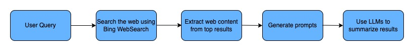

# GPT Researcher


GPT Researcher is a simple AI-based summarization tool for a user input query. Specifically, the tool performs the following

1) Accepts a user query
2) Searches the web for relevant results
3) Extracts the contents from the results
4) Generates a summary from those results using OpenAI API and returns the summary to the user


GPT Researcher is available both as a CLI tool as well as a web-based client.


# Installation and Setup

**Recommended Python Version**: Python 3.8 and greater


## 1. Repository setup


-  Clone the repository using the command `git clone https://github.com/AvinashBukkittu/gpt-researcher.git`

-  Install a python virtual environment using the commands below

```
cd gpt-researcher
python3 -m venv env
```

Refer to this documentation, https://packaging.python.org/en/latest/guides/installing-using-pip-and-virtual-environments/#creating-a-virtual-environment, if you are unable to create virtual environment.

Once the environment is installed, activate it by running `source env/bin/activate`.
- Install the requirements file by running `pip install -r requirements.txt`

## 2. Install the redis server using the instructions below


**Note**: Redis server is needed only for web-based solution. The CLI tool can be used without setting up Redis server.

To use the web-based solution, redis server needs to be running locally. Please follow the instructions here, https://redis.io/docs/getting-started/installation/, to install redis.

After installation, the redis server can be started as below:

**For Windows**: `sudo service redis-server start`
**For MacOS**: `brew services start redis`
**For LinuxOS**: `sudo systemctl start redis`


This article, https://tableplus.com/blog/2018/10/how-to-start-stop-restart-redis.html, gives a good explanation on how to set up Redis on all three platforms.

We can verify if the redis server is running by issuing the command, `redis-cli ping`. This should respond with `PONG`.

## 3. Setting up environment variables


Following environment variables need to be set up before running the program

- Set `BING_SEARCH_V7_SUBSCRIPTION_KEY` variable to the subscription key to use Bing's Websearch API. More details can be found here, https://www.microsoft.com/en-us/bing/apis/bing-web-search-api

- Set `OPENAI_API_KEY` variable to OpenAI's API KEY. More information can be found here, https://platform.openai.com/docs/quickstart/add-your-api-key

# How to run the tool?

- To run the web-based tool:
    - Ensure that redis server is running locally. Then start the backend server using the command `flask run`. This command should start the server on `localhost:5000`. Enter the query in the input field and click on `Summarize the results from the web`. You should see the status updates coming in from the backend. Once the processing is complete, you will see the summary results.
- To run CLI tool:
    - Run the command `python main.py -q "<enter-the-query-here>"`. This should call the backend service. On the terminal, you will see the logs showing the different processing stages. At the end, the tool will print the summary on the terminal.

# Implementation



The implementation of GPT Researcher can be divided into the following steps

## 1. Querying the web

In this step, the user inputted query is searched on the web using the Bing WebSearch API (more details, https://www.microsoft.com/en-us/bing/apis/bing-web-search-api). The API provides a rich set of features to customize the search results, however, for the purposes of demonstration, I am extracting top 10 results from the webpages.

## 2. Extracting content from the top results

In this step, I extract the web contents from the relevant documents returned from step-1 (for now, I extract top-10 documents). Here, I use the python library, `BeautifulSoup` to parse the web content. Parsing the document can get fairly complicated depending on the HTML structure, however, I only extract text from `<p>` and `<title>` tags. After extracting the web content, I collate the contents upto the maximum possible length (see `MAX_WEBPAGE_CONTENT_LENGTH_IN_CHARACTERS` in `utils.py`). Below I briefly explain, why we need to have maximum content length.

The LLMs that we use today have an upper limit on the context length of the query that is issued to the LLM. The web contents extracted from the internet can exceed this upper limit (we assume an upper limit of 4k tokens in this assignment). Assuming the query prompt and the summary will not exceed 500 tokens, we therefore, have an upper limit of ~3500 tokens (~14k characters) per LLM query. Therefore, during collation, we need to truncate the web content to not exceed 14k characters. If, during collation, I exceed the limit, I create a new string instead of concatenating to the existing string. I, therefore, return a list of collated web contents (`List[str`) in this step. See `extract_content_from_urls(...)` method in `utils.py` for the code. 

## 3. Generating prompts for extracted contents

For each of the collated web contents in step-2, I generate summary prompts which are used in step-4 to query the LLMs.

## 4. Summarizing the web content using the prompt

Using the prompts generated in step-3, I use OpenAI APIs to generate summaries for each prompt. I, then, concatenate these summaries and generate a final prompt. Using this final prompt, I generate a final summary that is returned to the users.

Here, I use the `gpt-3.5-turbo` model and ask it to summarize in 200 words (~250 tokens).

# Code Pointers

-  **Backend**
    - `utils.py`
		- Searching the web: Read `query_bing(...)`
		- Extracting contents from URLs: Read `extract_content_from_urls(...)`
		- Generate prompts: Read `generate_summary_prompts(...)`
		- Generate summary: Read `generate_summary(...)`
	- `app.py`
		- Read `index(...)` for details on how the request is processed

- **Frontend**
	- Refer `templates/index.html` and related CSS file for frontend logic 

- **CLI**
	- Refer `main.py` for details on how the CLI tool is developed


# Challenges

1) **Handling context length**: Since LLMs have an upper limit on the maximum context length per input, it is important that we correctly truncate the web contents to avoid errors from the LLMs. Assuming the query prompt and the summary will not exceed 500 tokens, we therefore have an upper limit of ~3500 tokens (~14k characters) per LLM query. Therefore, during collation, we need to truncate the web content to not exceed 14k characters. If, during collation, I exceed the limit, I create a new string instead of concatenating to the existing string. I return a list of collated web contents (`List[str`) in this step.

2) **Sending status updates to front-end**: After the user sends the query, it will take a considerable amount of time for the backend to process the query and return the summary. To improve the user experience, it is important that the backend sends updates on the different steps it is currently processing. For this purpose, I have used Server-Sent Events (SSE), through which the server can send updates to the client whenever it completes a step. For this use-case, SSE is preferred over websockets and long-polling techniques because the server just needs to send status updates while processing the query. I have used `Flask SSE` python library along with `Redis` to enable SSE (see: https://flask-sse.readthedocs.io/en/latest/quickstart.html).

3) **Improving summarization time through multiprocessing**: Extracting the contents from each URL can be time consuming. Similarly, the LLM can take considerable time to generate summary for each prompt. Therefore, to improve query processing time, I have used `multiprocessing` library to parallelly extract web content (step-2) and parallelly generate summary using the prompts (step-4). This makes the query get processed much faster and improves the user experience.


# Enhancements

1) **Provide advance search options**
	- The tool can be further improved to include advance search options. A few examples are below
		- Including results from multiple search engines (Google, DuckDuckGo, Yahoo etc)
		- Performing multi-modal search (include `news`, `images`, `webpages` etc in the search query)
		- Providing advance search filters like including results only from academia or excluding results from other domains etc.
		- Provide more customization on how many results to include (top-k results), max length of summary to generate etc

2) **Improve the web scraping and parsing logic**
	- Some websites maybe behind a payment or an authentication gateway. Some websites may block scripts from scraping the contents. The web scraping can be improved to handle such nuances. 

	- Parsing web content can be complicated depending on the HTML structure like extracting hyperlinks, image/video captions, header tags etc. Improved parsers can help extract better content.

3) **Improved prompting and use multiple LLMs for summarization**
	- Depending on the filters chosen by the user, we can improve the prompts generated that helps get better responses from the LLMs. We can also query multiple LLMs to better summarize user queries.

4) **Caching Results**
	- We could maintain a time-sensitive cache for web scraping which helps avoid re-scraping popular websites. Similarly, we can maintain time-sensitive caches to store LLM responses for user queries.


5) **Handling issues due to rate limits**
	- If this tool is to be scaled, we might encounter issues around rate limiting either during websearch or while summarizing the content using OpenAI APIs. These issues need to be carefully handled by retrying with some delays.